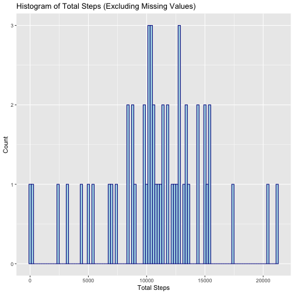
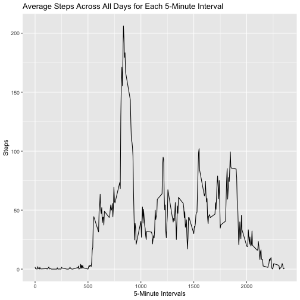
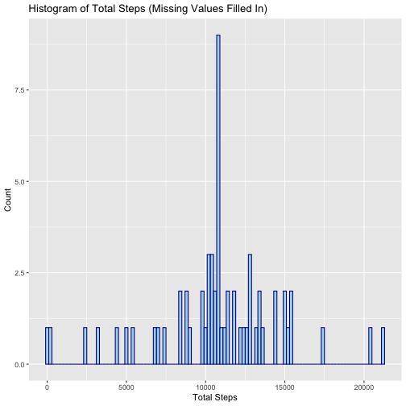
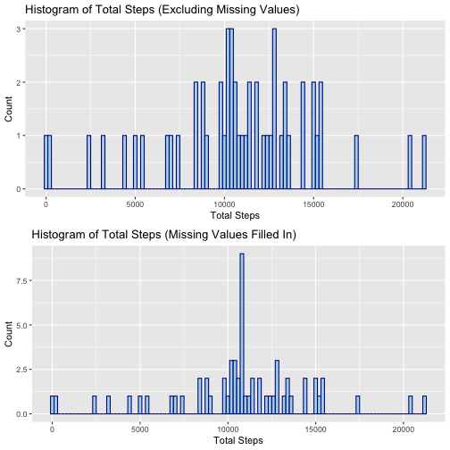
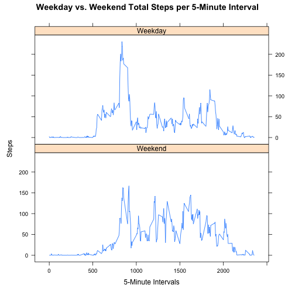

## Loading and preprocessing the data  

Show any code that is needed to

### 1. Load the data


```r
unzip("activity.zip")
dataset <- read.csv("activity.csv")
```

### 2. Process/transform the data (if necessary) into a format suitable for your analysis


```r
library(tidyr)
dataset$date <- as.Date(dataset$date)
z <- dataset %>% drop_na()
```

## What is mean total number of steps taken per day?

For this part of the assignment, you can ignore the missing values in the dataset.

### 1. Calculate the total number of steps taken per day


```r
library(dplyr)
y <- z %>% group_by(date) %>% mutate(total.steps = sum(steps)) %>% select(date, total.steps) %>% distinct %>% print(n = Inf)
```

```
## # A tibble: 53 x 2
## # Groups:   date [53]
##    date       total.steps
##    <date>           <int>
##  1 2012-10-02         126
##  2 2012-10-03       11352
##  3 2012-10-04       12116
##  4 2012-10-05       13294
##  5 2012-10-06       15420
##  6 2012-10-07       11015
##  7 2012-10-09       12811
##  8 2012-10-10        9900
##  9 2012-10-11       10304
## 10 2012-10-12       17382
## 11 2012-10-13       12426
## 12 2012-10-14       15098
## 13 2012-10-15       10139
## 14 2012-10-16       15084
## 15 2012-10-17       13452
## 16 2012-10-18       10056
## 17 2012-10-19       11829
## 18 2012-10-20       10395
## 19 2012-10-21        8821
## 20 2012-10-22       13460
## 21 2012-10-23        8918
## 22 2012-10-24        8355
## 23 2012-10-25        2492
## 24 2012-10-26        6778
## 25 2012-10-27       10119
## 26 2012-10-28       11458
## 27 2012-10-29        5018
## 28 2012-10-30        9819
## 29 2012-10-31       15414
## 30 2012-11-02       10600
## 31 2012-11-03       10571
## 32 2012-11-05       10439
## 33 2012-11-06        8334
## 34 2012-11-07       12883
## 35 2012-11-08        3219
## 36 2012-11-11       12608
## 37 2012-11-12       10765
## 38 2012-11-13        7336
## 39 2012-11-15          41
## 40 2012-11-16        5441
## 41 2012-11-17       14339
## 42 2012-11-18       15110
## 43 2012-11-19        8841
## 44 2012-11-20        4472
## 45 2012-11-21       12787
## 46 2012-11-22       20427
## 47 2012-11-23       21194
## 48 2012-11-24       14478
## 49 2012-11-25       11834
## 50 2012-11-26       11162
## 51 2012-11-27       13646
## 52 2012-11-28       10183
## 53 2012-11-29        7047
```

### 2. If you do not understand the difference between a histogram and a barplot, research the difference between them. Make a histogram of the total number of steps taken each day


```r
library(ggplot2)
plot1 <- ggplot(y, aes(x = date,  y = total.steps)) + geom_bar(stat = "identity", fill="steelblue") + labs(title="Histogram of Total Steps (Excluding Missing Values)", x = "Date", y = "Total Steps") + theme_minimal()
plot1
```



### 3. Calculate and report the mean and median of the total number of steps taken per day


```r
j <- z %>% group_by(date) %>% summarize(median = median(steps), mean = mean(steps)) %>% print(n = Inf)
```

```
## # A tibble: 53 x 3
##    date       median   mean
##    <date>      <dbl>  <dbl>
##  1 2012-10-02      0  0.438
##  2 2012-10-03      0 39.4  
##  3 2012-10-04      0 42.1  
##  4 2012-10-05      0 46.2  
##  5 2012-10-06      0 53.5  
##  6 2012-10-07      0 38.2  
##  7 2012-10-09      0 44.5  
##  8 2012-10-10      0 34.4  
##  9 2012-10-11      0 35.8  
## 10 2012-10-12      0 60.4  
## 11 2012-10-13      0 43.1  
## 12 2012-10-14      0 52.4  
## 13 2012-10-15      0 35.2  
## 14 2012-10-16      0 52.4  
## 15 2012-10-17      0 46.7  
## 16 2012-10-18      0 34.9  
## 17 2012-10-19      0 41.1  
## 18 2012-10-20      0 36.1  
## 19 2012-10-21      0 30.6  
## 20 2012-10-22      0 46.7  
## 21 2012-10-23      0 31.0  
## 22 2012-10-24      0 29.0  
## 23 2012-10-25      0  8.65 
## 24 2012-10-26      0 23.5  
## 25 2012-10-27      0 35.1  
## 26 2012-10-28      0 39.8  
## 27 2012-10-29      0 17.4  
## 28 2012-10-30      0 34.1  
## 29 2012-10-31      0 53.5  
## 30 2012-11-02      0 36.8  
## 31 2012-11-03      0 36.7  
## 32 2012-11-05      0 36.2  
## 33 2012-11-06      0 28.9  
## 34 2012-11-07      0 44.7  
## 35 2012-11-08      0 11.2  
## 36 2012-11-11      0 43.8  
## 37 2012-11-12      0 37.4  
## 38 2012-11-13      0 25.5  
## 39 2012-11-15      0  0.142
## 40 2012-11-16      0 18.9  
## 41 2012-11-17      0 49.8  
## 42 2012-11-18      0 52.5  
## 43 2012-11-19      0 30.7  
## 44 2012-11-20      0 15.5  
## 45 2012-11-21      0 44.4  
## 46 2012-11-22      0 70.9  
## 47 2012-11-23      0 73.6  
## 48 2012-11-24      0 50.3  
## 49 2012-11-25      0 41.1  
## 50 2012-11-26      0 38.8  
## 51 2012-11-27      0 47.4  
## 52 2012-11-28      0 35.4  
## 53 2012-11-29      0 24.5
```

## What is the average daily activity pattern?

### 1. Make a time series plot (i.e. type = "l") of the 5-minute interval (x-axis) and the average number of steps taken, averaged across all days (y-axis)


```r
a <- z %>% group_by(interval) %>% summarize(average.steps = mean(steps))

ggplot(a, aes(x=interval, y=average.steps)) + geom_line() + xlab("5-Minute Intervals") + ylab("Steps") + ggtitle("Average Steps Across All Days for Each 5-Minute Interval")
```



### 2. Which 5-minute interval, on average across all the days in the dataset, contains the maximum number of steps?


```r
a[which.max(a$average.steps),]
```

```
## # A tibble: 1 x 2
##   interval average.steps
##      <int>         <dbl>
## 1      835          206.
```

```r
print(paste("The 5-minute interval with the maximum number of steps on average across all the days is the", paste(as.character(a[which.max(a$average.steps),1]), "th", sep=""), "interval"))
```

```
## [1] "The 5-minute interval with the maximum number of steps on average across all the days is the 835th interval"
```

## Imputing missing values
Note that there are a number of days/intervals where there are missing values (coded as NA). The presence of missing days may introduce bias into some calculations or summaries of the data.

### 1. Calculate and report the total number of missing values in the dataset (i.e. the total number of rows with NAs). 


```r
print(paste("There are", (sum(is.na(dataset))), "missing values"))
```

```
## [1] "There are 2304 missing values"
```

### 2. Devise a strategy for filling in all of the missing values in the dataset. The strategy does not need to be sophisticated. For example, you could use the mean/median for that day, or the mean for that 5-minute interval, etc.

Strategy: Will fill in the missing values with the mean for that 5-minutes interval (as averaged across all the days), see variable "a" above. 

### 3. Create a new dataset that is equal to the original dataset but with the missing data filled in.


```r
b <- a %>% rename(steps = average.steps)

c <- dataset %>% inner_join(b, by = "interval") %>% mutate(steps = coalesce(steps.x, steps.y)) %>% select(date, interval, steps)
```

### 4. Make a histogram of the total number of steps taken each day and Calculate and report the mean and median total number of steps taken per day. Do these values differ from the estimates from the first part of the assignment? What is the impact of imputing missing data on the estimates of the total daily number of steps?


```r
d <- c %>% group_by(date) %>% mutate(total.steps = sum(steps)) %>% select(total.steps, date) %>% distinct

plot2 <- ggplot(d, aes(x = date,  y = total.steps)) + geom_bar(stat = "identity", fill="steelblue") + labs(title="Histogram of Total Steps (Missing Values Filled In)", x = "Date", y = "Total Steps") + theme_minimal()
plot2
```



```r
c %>% group_by(date) %>% summarize(median = median(steps), mean = mean(steps)) %>% print(n = Inf)
```

```
## # A tibble: 61 x 3
##    date       median   mean
##    <date>      <dbl>  <dbl>
##  1 2012-10-01   34.1 37.4  
##  2 2012-10-02    0    0.438
##  3 2012-10-03    0   39.4  
##  4 2012-10-04    0   42.1  
##  5 2012-10-05    0   46.2  
##  6 2012-10-06    0   53.5  
##  7 2012-10-07    0   38.2  
##  8 2012-10-08   34.1 37.4  
##  9 2012-10-09    0   44.5  
## 10 2012-10-10    0   34.4  
## 11 2012-10-11    0   35.8  
## 12 2012-10-12    0   60.4  
## 13 2012-10-13    0   43.1  
## 14 2012-10-14    0   52.4  
## 15 2012-10-15    0   35.2  
## 16 2012-10-16    0   52.4  
## 17 2012-10-17    0   46.7  
## 18 2012-10-18    0   34.9  
## 19 2012-10-19    0   41.1  
## 20 2012-10-20    0   36.1  
## 21 2012-10-21    0   30.6  
## 22 2012-10-22    0   46.7  
## 23 2012-10-23    0   31.0  
## 24 2012-10-24    0   29.0  
## 25 2012-10-25    0    8.65 
## 26 2012-10-26    0   23.5  
## 27 2012-10-27    0   35.1  
## 28 2012-10-28    0   39.8  
## 29 2012-10-29    0   17.4  
## 30 2012-10-30    0   34.1  
## 31 2012-10-31    0   53.5  
## 32 2012-11-01   34.1 37.4  
## 33 2012-11-02    0   36.8  
## 34 2012-11-03    0   36.7  
## 35 2012-11-04   34.1 37.4  
## 36 2012-11-05    0   36.2  
## 37 2012-11-06    0   28.9  
## 38 2012-11-07    0   44.7  
## 39 2012-11-08    0   11.2  
## 40 2012-11-09   34.1 37.4  
## 41 2012-11-10   34.1 37.4  
## 42 2012-11-11    0   43.8  
## 43 2012-11-12    0   37.4  
## 44 2012-11-13    0   25.5  
## 45 2012-11-14   34.1 37.4  
## 46 2012-11-15    0    0.142
## 47 2012-11-16    0   18.9  
## 48 2012-11-17    0   49.8  
## 49 2012-11-18    0   52.5  
## 50 2012-11-19    0   30.7  
## 51 2012-11-20    0   15.5  
## 52 2012-11-21    0   44.4  
## 53 2012-11-22    0   70.9  
## 54 2012-11-23    0   73.6  
## 55 2012-11-24    0   50.3  
## 56 2012-11-25    0   41.1  
## 57 2012-11-26    0   38.8  
## 58 2012-11-27    0   47.4  
## 59 2012-11-28    0   35.4  
## 60 2012-11-29    0   24.5  
## 61 2012-11-30   34.1 37.4
```

```r
e <- c %>% group_by(date) %>% summarize(median = median(steps), mean = mean(steps)) %>% rename(median.filled = median, mean.filled = mean)

compare <- full_join(e, j)
```

```
## Joining, by = "date"
```

```r
print(compare, n = Inf)
```

```
## # A tibble: 61 x 5
##    date       median.filled mean.filled median   mean
##    <date>             <dbl>       <dbl>  <dbl>  <dbl>
##  1 2012-10-01          34.1      37.4       NA NA    
##  2 2012-10-02           0         0.438      0  0.438
##  3 2012-10-03           0        39.4        0 39.4  
##  4 2012-10-04           0        42.1        0 42.1  
##  5 2012-10-05           0        46.2        0 46.2  
##  6 2012-10-06           0        53.5        0 53.5  
##  7 2012-10-07           0        38.2        0 38.2  
##  8 2012-10-08          34.1      37.4       NA NA    
##  9 2012-10-09           0        44.5        0 44.5  
## 10 2012-10-10           0        34.4        0 34.4  
## 11 2012-10-11           0        35.8        0 35.8  
## 12 2012-10-12           0        60.4        0 60.4  
## 13 2012-10-13           0        43.1        0 43.1  
## 14 2012-10-14           0        52.4        0 52.4  
## 15 2012-10-15           0        35.2        0 35.2  
## 16 2012-10-16           0        52.4        0 52.4  
## 17 2012-10-17           0        46.7        0 46.7  
## 18 2012-10-18           0        34.9        0 34.9  
## 19 2012-10-19           0        41.1        0 41.1  
## 20 2012-10-20           0        36.1        0 36.1  
## 21 2012-10-21           0        30.6        0 30.6  
## 22 2012-10-22           0        46.7        0 46.7  
## 23 2012-10-23           0        31.0        0 31.0  
## 24 2012-10-24           0        29.0        0 29.0  
## 25 2012-10-25           0         8.65       0  8.65 
## 26 2012-10-26           0        23.5        0 23.5  
## 27 2012-10-27           0        35.1        0 35.1  
## 28 2012-10-28           0        39.8        0 39.8  
## 29 2012-10-29           0        17.4        0 17.4  
## 30 2012-10-30           0        34.1        0 34.1  
## 31 2012-10-31           0        53.5        0 53.5  
## 32 2012-11-01          34.1      37.4       NA NA    
## 33 2012-11-02           0        36.8        0 36.8  
## 34 2012-11-03           0        36.7        0 36.7  
## 35 2012-11-04          34.1      37.4       NA NA    
## 36 2012-11-05           0        36.2        0 36.2  
## 37 2012-11-06           0        28.9        0 28.9  
## 38 2012-11-07           0        44.7        0 44.7  
## 39 2012-11-08           0        11.2        0 11.2  
## 40 2012-11-09          34.1      37.4       NA NA    
## 41 2012-11-10          34.1      37.4       NA NA    
## 42 2012-11-11           0        43.8        0 43.8  
## 43 2012-11-12           0        37.4        0 37.4  
## 44 2012-11-13           0        25.5        0 25.5  
## 45 2012-11-14          34.1      37.4       NA NA    
## 46 2012-11-15           0         0.142      0  0.142
## 47 2012-11-16           0        18.9        0 18.9  
## 48 2012-11-17           0        49.8        0 49.8  
## 49 2012-11-18           0        52.5        0 52.5  
## 50 2012-11-19           0        30.7        0 30.7  
## 51 2012-11-20           0        15.5        0 15.5  
## 52 2012-11-21           0        44.4        0 44.4  
## 53 2012-11-22           0        70.9        0 70.9  
## 54 2012-11-23           0        73.6        0 73.6  
## 55 2012-11-24           0        50.3        0 50.3  
## 56 2012-11-25           0        41.1        0 41.1  
## 57 2012-11-26           0        38.8        0 38.8  
## 58 2012-11-27           0        47.4        0 47.4  
## 59 2012-11-28           0        35.4        0 35.4  
## 60 2012-11-29           0        24.5        0 24.5  
## 61 2012-11-30          34.1      37.4       NA NA
```

The median and means do not differ as the missing values were only filled in for the rows that had NA values, i.e., the dates without missing values still retain the same median and mean. 

We can compare the two graphs of total steps

```r
library(gridExtra)
grid.arrange(plot1, plot2, ncol = 1)
```



Filling in the missing values created a spike at 10766.19 steps. This so happens to also be the mean of total steps. 

```r
mean(d$total.steps)
```

```
## [1] 10766.19
```
This makes sense given that we filled in missing values with the mean for that 5-minute interval (as averaged across all days). 

## Are there differences in activity patterns between weekdays and weekends?

For this part the weekdays() function may be of some help here. Use the dataset with the filled-in missing values for this part.

### 1. Create a new factor variable in the dataset with two levels – “weekday” and “weekend” indicating whether a given date is a weekday or weekend day.


```r
weekdays <- c("Monday", "Tuesday", "Wednesday", "Thursday", "Friday")
c$day <- factor((weekdays(c$date) %in% weekdays), levels = c(FALSE, TRUE), labels=c("Weekend", "Weekday"))
```

### 2. Make a panel plot containing a time series plot (i.e. type = "l") of the 5-minute interval (x-axis) and the average number of steps taken, averaged across all weekday days or weekend days (y-axis). See the README file in the GitHub repository to see an example of what this plot should look like using simulated data.


```r
k <- c %>% group_by(day, interval) %>% summarize(average.steps = mean(steps))
```

```
## `summarise()` has grouped output by 'day'. You can override using the `.groups` argument.
```

```r
library(lattice)
xyplot(average.steps ~ interval | day, data = k, layout = c(1,2), type = "l", main = "Weekday vs. Weekend Total Steps per 5-Minute Interval", xlab = "5-Minute Intervals", ylab = "Steps")
```


